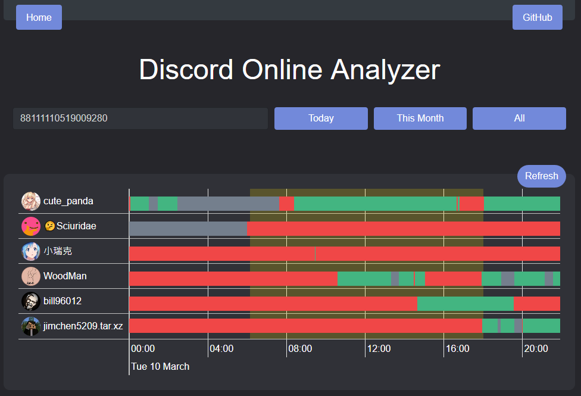

## Analysis_Bot_Web
You can check out introduction to this repo on my blog: [here](https://blog.woodman.tw/2020/03/11/%E5%B0%88%E6%A1%88%E4%BB%8B%E7%B4%B9-Discord-Analysis-Bot/)  

## Chart
~~Chart use [Visavail.js](https://github.com/flrs/visavail#visavailjs---a-time-data-availability-chart)~~  
Change chart to [vis-timeline](https://github.com/visjs/vis-timeline)  

## Project setup
```
npm install
Edit cfg/setting.js.example and rename it cfg/setting.js
```

### Start dev server
```
npm run dev
```

### Compiles and minifies for production
```
npm run build
```

### Lints and fixes files
```
npm run lint
```

### Customize configuration
See [Configuration Reference](https://cli.vuejs.org/config/).

# Thanks
* [jimchen5209](https://jimchen5209.me) **Assist front-end**
* [bill96012](https://github.com/bill96012) **UI/UX**
* [james58899](https://github.com/james58899) **Idea of sunrise and sunset**
